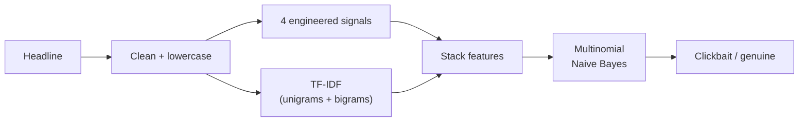

<div align="center">
  
  <h1>Deb8</h1>
  <p><strong>A clickbait detector that judges headlines by how they are written.</strong></p>
  <p>Paste a headline and a Multinomial Naive Bayes model, trained on the TF-IDF profile of ~52,000 headlines plus four hand-built signals, tells you whether it reads like news or like bait. Built with scikit-learn, NLTK, pandas, and Streamlit.</p>

  <p>
    
    
    
    
    <a href="https://deb-eight.streamlit.app/"></a>
  </p>
</div>

> **Note:** Deb8 is an undergraduate NLP project. It judges the phrasing of a headline, not the truth of the story underneath it, and it was trained on English headlines from 2007 to 2020. Read its verdicts accordingly.

**Live app:** [deb-eight.streamlit.app](https://deb-eight.streamlit.app/)

## Contents

- [What it does](#what-it-does)
- [Where it started](#where-it-started)
- [The data](#the-data)
- [How a headline is classified](#how-a-headline-is-classified)
- [What the exploration showed](#what-the-exploration-showed)
- [Results](#results)
- [The notebooks](#the-notebooks)
- [The app](#the-app)
- [Getting started](#getting-started)
- [Deploying](#deploying)
- [Project structure](#project-structure)
- [Limitations](#limitations)
- [Future work](#future-work)
- [Credits](#credits)
- [License](#license)

## What it does

You give Deb8 a headline. It lowercases the text, strips URLs, punctuation, and stray characters, and computes four small signals: how many words the headline has, whether it reads as a question, whether it carries an exclamation mark, and whether it opens with a digit. The cleaned text then becomes a TF-IDF vector over unigrams and bigrams, the four signals are stacked alongside, and a Multinomial Naive Bayes classifier returns a verdict: clickbait or genuine.

The app shows its work. An expander under every verdict lists the cleaned text the vectorizer received and the state of all four signals, so when "17 Things Only People Who Hate Mornings Will Understand" comes back flagged, you can see the opening digit tripping the number signal and the exact tokens the model weighed.

## Where it started

Deb8 was the term project for an undergraduate NLP course, built by a team of four. Read the name aloud and you get the job description: de-bait. The brief was to build a working clickbait detector end to end, from collecting our own data to serving a model behind a web page, rather than training on a canned dataset and stopping at a confusion matrix. The original term paper is included at [docs/deb8-project-report.pdf](docs/deb8-project-report.pdf), and the whole build lives in seven numbered notebooks.

The part that took the most effort was not the modeling. It was getting 20,000 fresh headlines out of Twitter and four news APIs in 2020, which is also the part of the project that has aged the worst (more on that under [Limitations](#limitations)).

## The data

The training corpus is two datasets merged, one borrowed and one collected by hand.

**Borrowed: the Kaggle clickbait dataset (2007-2016).** Published by Aman Anand Rai, 32,000 headlines split evenly between classes. The clickbait half comes from BuzzFeed, Upworthy, ViralNova, Thatscoop, Scoopwhoop, and ViralStories; the news half from WikiNews, The New York Times, The Guardian, and The Hindu. Available [on Kaggle](https://www.kaggle.com/amananandrai/clickbait-dataset).

**Collected: our 2019-2020 scrape.** 20,174 headlines pulled over a few weeks in mid-2020, with the class label decided by the source:

| Source | Method | Headlines | Class |
| --- | --- | --- | --- |
| BuzzFeed, Bored Panda, Examiner, The Odyssey, Upworthy, The Political Insider (Twitter) | GetOldTweets3 | 11,116 | clickbait |
| The New York Times | Archive API via pynytimes | 5,299 | genuine |
| The Guardian | Content API | 3,400 | genuine |
| The Washington Post | newspaper3k site crawl | 169 | genuine |
| Bloomberg | NewsAPI | 98 | genuine |
| Reuters | NewsAPI | 92 | genuine |

The lopsided counts are artifacts of what each pipe allowed. The NYT archive endpoint hands over a whole month at a time; the free NewsAPI tier caps out at a few pages, which is why Reuters and Bloomberg contribute fewer than a hundred headlines each.

Merged, the corpus holds 52,174 headlines; dropping rows that clean down to nothing leaves 52,127, split 27,115 clickbait to 25,059 genuine (52/48). The term paper rounds these to "30,000 plus 22,000"; the notebooks say 32,000 plus 20,174, and the notebooks are the ones that ran.

## How a headline is classified

Cleaning is deliberately blunt: lowercase everything, drop URLs, newlines, doubled spaces, bracketed text, all ASCII punctuation, and a handful of curly quote characters. Numbers survive on purpose, because "17 Things" is half the genre.

Four engineered features are computed on the cleaned text:

- `headline_words`: word count
- `question`: 1 if the headline contains a question mark or opens with an interrogative (*who*, *what*, *how*, *should*, and so on)
- `exclamation`: 1 if an exclamation mark is present
- `starts_with_num`: 1 if the first character is a digit

One quirk worth knowing: because these run *after* cleaning, the punctuation-based checks rarely fire. The question marks are already stripped by the time the question check looks for them, so that signal mostly triggers on interrogative openings, and the exclamation flag is lit on just 558 rows in the entire corpus. Not the original intent, but the app reproduces the training pipeline exactly, and consistency between training and serving is the property that actually matters.

The text itself goes through a TF-IDF vectorizer with NLTK's English stopwords removed and both unigrams and bigrams kept. The fitted vocabulary spans 203,132 terms; with the four signals stacked on the front, each headline becomes a 203,136-column sparse row. Training used a 75/25 split (39,095 train, 13,032 test).



## What the exploration showed

The two classes barely speak the same language. The most frequent clickbait tokens after stopword removal are *people*, *things*, *make*, *know*, *like*, *best*, and *actually*, with the bare numbers 17, 21, and 19 all inside the top twenty, which is what a decade of listicles does to a corpus. The news half is led by *us*, *police*, *says*, *dies*, *election*, and *court*. Both lists contain *trump* and *coronavirus*, which dates the scrape as precisely as a timestamp would.

The engineered features point the same way: clickbait headlines run a little longer on average, are far more likely to open with a number, and pose questions more often. Across the whole corpus 4,784 headlines read as questions.

## Results

Test-split accuracy and clickbait-class recall for every model tried in [notebook 07](notebooks/07-modeling-interpretation-tuning.ipynb):

| Model | Test accuracy | Test recall |
| --- | --- | --- |
| Majority-class baseline | 0.523 | 1.000 |
| **Multinomial Naive Bayes (deployed)** | **0.930** | **0.942** |
| Linear SVM | 0.932 | 0.926 |
| Logistic Regression | 0.931 | 0.924 |
| Random Forest | 0.906 | 0.933 |
| Random Forest, grid-searched | 0.901 | 0.903 |
| XGBoost | 0.857 | 0.856 |

The baseline row is there for scale: predict "clickbait" for everything and you get 52.3% accuracy and perfect recall for free, so the real models have to clear that bar, not zero.

We picked recall as the metric to favor, on the theory that a clickbait headline waved through is worse than a Reuters headline wrongly flagged. Naive Bayes posted the best recall of the group, sat within a quarter point of the SVM on accuracy, trains in seconds, and pickles small enough to serve from a free hosting tier. That made deployment an easy call.

Two honest footnotes. First, Naive Bayes, the SVM, and Logistic Regression all score 99.9% on the training set, so the gap down to 93% on test is genuine overfitting, and every number in the table comes from a held-out quarter of the *same* corpus, which flatters any model. Second, the grid search: two-fold cross-validation over tree depth and count for the Random Forest burned 21 minutes of compute and produced a model that scores *worse* on the test split than the untouched default. A tidy lesson in narrow grids.

The coefficient analysis at the end of the notebook ranks the engineered signals the way you would hope: in the Logistic Regression, an exclamation mark is the strongest single clickbait tell (+6.4), followed by opening with a number (+4.3) and question phrasing (+1.4).

## The notebooks

The build is documented start to finish in [notebooks/](notebooks/), numbered in the order the pipeline runs:

| Notebook | What it covers |
| --- | --- |
| [01](notebooks/01-twitter-scraper-clickbait.ipynb) | Scraping six clickbait Twitter accounts with GetOldTweets3 |
| [02](notebooks/02-newsapi-scraper-non-clickbait.ipynb) | Pulling Reuters and Bloomberg headlines through NewsAPI |
| [03](notebooks/03-guardian-api-scraper-non-clickbait.ipynb) | Paging through The Guardian's content API |
| [04](notebooks/04-nytimes-api-scraper-non-clickbait.ipynb) | Monthly archives from the NYT API via pynytimes |
| [05](notebooks/05-washington-post-scraper-non-clickbait.ipynb) | Crawling washingtonpost.com with newspaper3k |
| [06](notebooks/06-consolidation-cleaning-feature-engineering-eda.ipynb) | Merging both datasets, cleaning, feature engineering, EDA |
| [07](notebooks/07-modeling-interpretation-tuning.ipynb) | Training all six models, tuning, coefficient analysis |

The notebooks are a 2020 time capsule and should be read as documentation rather than rerun. They were written against Python 3.7 with the CSVs sitting in the working directory, the API keys are blanked out, and GetOldTweets3 stopped working when Twitter shut down the endpoint it depended on. The datasets they produced are all checked in under [data/](data/), so nothing needs rerunning to work with the project.

## The app

The Streamlit app is a single page. A form takes the headline, and submitting it returns a verdict card: a red alert for clickbait or a green all-clear, each with a one-line explanation. The "What the model saw" expander below shows the cleaned text and the four engineered signals, and the sidebar summarizes the method, the training data, and the headline numbers, with links back here.

Both serving artifacts live in [models/](models/): `naive_bayes_model.pkl` is the trained classifier and `tfidf_vectorizer.pkl` is the fitted vectorizer, with the stopword list and 203k-term vocabulary baked in. The app needs only scikit-learn, scipy, numpy, Pillow, and Streamlit at runtime.

## Getting started

The hosted copy at [deb-eight.streamlit.app](https://deb-eight.streamlit.app/) needs no setup. To run it locally you need Python 3.9 or newer:

```bash
git clone https://github.com/rsvptr/deb8.git
cd deb8
pip install -r requirements.txt
streamlit run streamlit_app.py
```

Then open [http://localhost:8501](http://localhost:8501). Loading 2020-era pickles under a current scikit-learn triggers a version warning, which the app suppresses; predictions are unaffected.

## Deploying

The app runs on Streamlit Community Cloud, which is how [deb-eight.streamlit.app](https://deb-eight.streamlit.app/) is hosted. Point a new Streamlit Cloud app at this repository with `streamlit_app.py` as the entrypoint and it deploys as is: `requirements.txt` supplies the packages, and there are no secrets, databases, or environment variables involved.

## Project structure

```text
deb8/
├── .streamlit/
│   └── config.toml               Dark theme for the app
├── data/
│   ├── scraped/                  Raw scraper output, one CSV per source
│   └── processed/                Merged corpus, with and without engineered features
├── docs/
│   ├── deb8-project-report.pdf   The original term paper
│   └── logo.png                  App icon, favicon, and README logo
├── models/
│   ├── naive_bayes_model.pkl     Deployed classifier
│   └── tfidf_vectorizer.pkl      Fitted TF-IDF vectorizer (203k-term vocabulary)
├── notebooks/                    The full build, notebooks 01 through 07
├── streamlit_app.py              The web app
├── requirements.txt
└── LICENSE
```

Two oddities in `data/scraped/` are preserved as found: `twitter_webscrape_intermediate.csv` is a checkpoint from the Twitter scrape kept for provenance, and `twpscraper_news_source_urls.csv` is actually a JSON object that notebook 05 wrote with a `.csv` extension. A second Washington Post pull via NewsAPI (`twp_newsapi_scraped_titles_nonclickbait.csv`, 98 rows) was never merged into the corpus.

## Limitations

- The model judges phrasing, not truth. A fabricated story under a sober headline passes; a real story under a breathless one may not.
- English only, and the vocabulary is frozen in 2007-2020. *Coronavirus* sits in the top twenty tokens of both classes, and headlines about anything after mid-2020 are off-distribution by definition.
- Every scraped clickbait headline arrived through six Twitter accounts, and the genuine class leans heavily on three outlets. Some of what the model learned is probably house style rather than clickbait itself.
- The question and exclamation signals fire less often than designed because they are computed after punctuation is stripped (see [How a headline is classified](#how-a-headline-is-classified)).
- The 99.9% training accuracy means the model has effectively memorized its training set; the published test scores come from the same distribution and should be read as an upper bound.
- The models are pickled scikit-learn objects from 2020. Current scikit-learn loads them with a warning; a future version may refuse outright.
- The scraping notebooks no longer run as written: GetOldTweets3 is dead, and the free NewsAPI tier was always as limiting as the tiny Reuters and Bloomberg counts suggest.

## Future work

Three things would help, in rough order of effort:

1. **A fresh test set.** The cheapest, most informative next step: label a few thousand 2024+ headlines and measure how far the model has drifted from its 93%. Given the vocabulary freeze, the realistic expectation is: far.
2. **Topic features.** The term paper proposed LDA-derived topics as additional features, on the theory that clickbait clusters around certain subjects. Never built; still plausible.
3. **A neural successor.** Naive Bayes over TF-IDF reads surface style, which was a fair fight against 2020 clickbait farms. A fine-tuned transformer would likely gain a few points and hold up better against headline styles that have shifted since.

## Credits

Built with Emma Mary Cyriac, Krushang Sirikonda, and Riya Rajesh as a group project at IIIT Sri City. The 2007-2016 half of the corpus is the [clickbait dataset](https://www.kaggle.com/amananandrai/clickbait-dataset) published on Kaggle by Aman Anand Rai.

## License

MIT. See [LICENSE](LICENSE).
